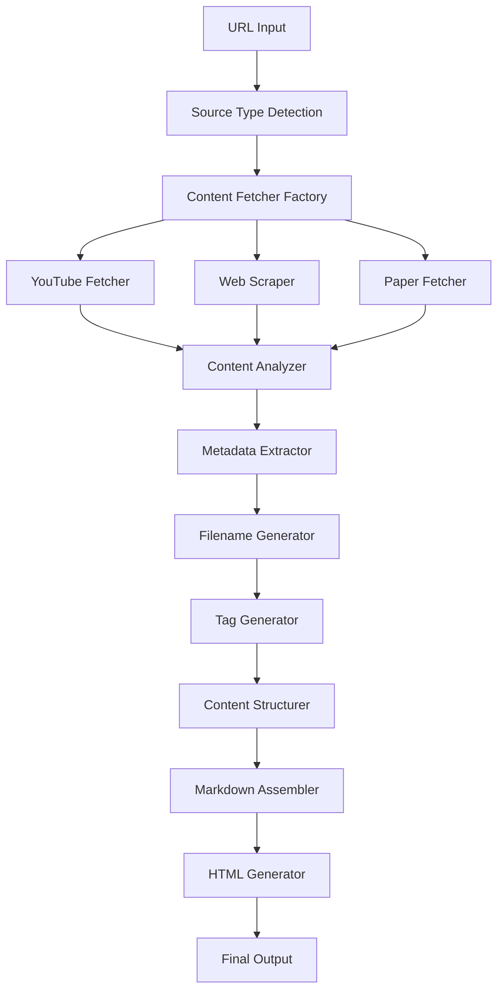

# Design Document

## Overview

The Obsidian Converter is a two-phase system that transforms web content into standardized Markdown notes with embedded HTML download functionality. The system follows a pipeline architecture where content flows through distinct processing stages: source analysis, metadata extraction, content structuring, and HTML generation.

The design emphasizes modularity, extensibility for different source types, and strict adherence to the "Gemini Gem" format specification.

## Architecture

### High-Level Architecture



### Core Components

1. **Source Detection Engine**: Analyzes URLs to determine content type
2. **Content Fetcher Factory**: Creates appropriate fetchers based on source type
3. **Metadata Extraction Pipeline**: Processes raw content into structured metadata
4. **Tag Generation System**: Applies tagging rules and normalization
5. **Content Structure Engine**: Organizes content into canonical sections
6. **Output Generation Layer**: Creates final Markdown and HTML artifacts

## Components and Interfaces

### 1. Source Detection Engine

**Purpose**: Automatically identify source type from URL patterns

**Interface**:
```typescript
interface SourceDetector {
  detectSourceType(url: string): SourceType;
  validateUrl(url: string): boolean;
  normalizeUrl(url: string): string;
}

enum SourceType {
  YOUTUBE = 'youtube',
  WEBPAGE = 'webpage', 
  ARTICLE = 'article',
  PAPER = 'paper',
  TALK = 'talk',
  PODCAST = 'podcast'
}
```

**Implementation Strategy**:
- URL pattern matching using regex
- Domain-based classification
- Content-type header analysis for ambiguous cases

### 2. Content Fetcher Factory

**Purpose**: Create specialized fetchers for different content types

**Interface**:
```typescript
interface ContentFetcher {
  fetch(url: string): Promise<RawContent>;
  extractMetadata(content: RawContent): ContentMetadata;
  generateResourceId(url: string): string;
}

interface RawContent {
  title: string;
  content: string;
  metadata: Record<string, any>;
  transcript?: string;
  duration?: number;
}
```

**Specialized Fetchers**:
- **YouTubeFetcher**: Uses YouTube Data API v3 for metadata, transcript extraction
- **WebScraper**: HTML parsing with content extraction algorithms
- **PaperFetcher**: Academic paper metadata extraction
- **TalkFetcher**: Conference/presentation content processing

### 3. Metadata Extraction Pipeline

**Purpose**: Transform raw content into structured metadata following schema requirements

**Interface**:
```typescript
interface MetadataExtractor {
  extractCoreMetadata(content: RawContent, sourceType: SourceType): CoreMetadata;
  generateEntities(content: string): EntityData;
  extractKeywords(content: string): string[];
}

interface CoreMetadata {
  title: string;
  channelName: string;
  publicationDate: string;
  duration?: string;
  durationSeconds?: number;
  language: string;
}
```

### 4. Tag Generation System

**Purpose**: Apply consistent tagging rules with normalization and validation

**Interface**:
```typescript
interface TagGenerator {
  generateRequiredTags(sourceType: SourceType, metadata: CoreMetadata): string[];
  generateTopicTags(content: string): string[];
  normalizeTags(tags: string[]): string[];
  validateTagFormat(tag: string): boolean;
}
```

**Tag Registry**:
- Maintains canonical tag mappings
- Handles alias resolution
- Enforces namespace conventions
- Validates tag format compliance

### 5. Content Structure Engine

**Purpose**: Organize content into the canonical "Gemini Gem" section format

**Interface**:
```typescript
interface ContentStructurer {
  generateTLDR(content: string): string[];
  createExecutiveSummary(content: string): string;
  extractKeyTopics(content: string): string[];
  buildTimeline(content: string, sourceType: SourceType): TimelineEntry[];
  extractQuotes(content: string): Quote[];
  generateGlossary(content: string): GlossaryEntry[];
  identifyClaimsAndEvidence(content: string): ClaimEvidence[];
  createActionableInsights(content: string): string[];
  generateOpenQuestions(content: string): string[];
}
```

### 6. Output Generation Layer

**Purpose**: Assemble final Markdown and HTML outputs

**Interface**:
```typescript
interface OutputGenerator {
  assembleMarkdown(metadata: ProcessedMetadata, structuredContent: StructuredContent): string;
  generateHTML(markdown: string, filename: string): string;
  createDownloadFunction(content: string, filename: string): string;
}
```

## Data Models

### Core Data Structures

```typescript
interface ProcessedMetadata {
  schema: string;
  id: string;
  title: string;
  sourceUrl: string;
  canonicalUrl: string;
  captureDate: string;
  sourceType: SourceType;
  channelName: string;
  publicationDate: string;
  language: string;
  duration?: string;
  durationSeconds?: number;
  tags: string[];
  keywords: string[];
  entities: EntityData;
}

interface EntityData {
  people: string[];
  orgs: string[];
  products: string[];
}

interface StructuredContent {
  tldr: string[];
  executiveSummary: string;
  keyTopics: string[];
  timeline: TimelineEntry[];
  quotes: Quote[];
  glossary: GlossaryEntry[];
  claimsEvidence: ClaimEvidence[];
  actionableInsights: string[];
  openQuestions: string[];
  sourceNotes: string;
  references: string[];
}
```

### Filename Generation Logic

```typescript
interface FilenameGenerator {
  generateFilename(metadata: ProcessedMetadata): string;
  createPrefix(sourceType: SourceType): string;
  generateSourceToken(channelName: string): string;
  createSlug(title: string): string;
  formatResourceId(rid: string): string;
}
```

**Filename Construction Rules**:
1. Prefix mapping: `youtube→yt_`, `webpage→web_`, etc.
2. Source token: lowercase, ASCII, kebab-case channel/site name
3. Slug: ASCII, kebab-case title, max 80 characters
4. Resource ID: stable identifier based on source type

## Error Handling

### Error Categories

1. **Network Errors**: Failed URL fetching, API rate limits
2. **Content Parsing Errors**: Invalid HTML, missing metadata
3. **Validation Errors**: Invalid URLs, unsupported content types
4. **Generation Errors**: Template rendering failures, file system issues

### Error Handling Strategy

```typescript
interface ErrorHandler {
  handleNetworkError(error: NetworkError): ErrorResponse;
  handleParsingError(error: ParsingError): ErrorResponse;
  handleValidationError(error: ValidationError): ErrorResponse;
  retryWithBackoff(operation: () => Promise<any>, maxRetries: number): Promise<any>;
}
```

**Recovery Mechanisms**:
- Automatic retry with exponential backoff for transient failures
- Graceful degradation for missing optional metadata
- Fallback content extraction methods
- User-friendly error messages with actionable guidance

## Testing Strategy

### Unit Testing

**Content Fetchers**:
- Mock API responses for different content types
- Test metadata extraction accuracy
- Validate resource ID generation consistency

**Tag Generation**:
- Test tag normalization rules
- Validate namespace compliance
- Test alias resolution accuracy

**Content Structuring**:
- Test section generation with various content types
- Validate timeline extraction for videos
- Test quote extraction and formatting

### Integration Testing

**End-to-End Workflows**:
- Complete URL-to-HTML conversion pipeline
- Cross-source-type consistency validation
- Filename generation uniqueness testing

**API Integration**:
- YouTube API integration with real video data
- Web scraping with various website structures
- Error handling with invalid/inaccessible URLs

### Performance Testing

**Content Processing**:
- Large document processing performance
- Concurrent request handling
- Memory usage optimization for long transcripts

**Output Generation**:
- HTML generation performance with large Markdown files
- File download functionality across browsers

## Implementation Considerations

### Extensibility

The system is designed for easy extension to new source types:
1. Implement `ContentFetcher` interface for new source
2. Add source type to `SourceType` enum
3. Update tag generation rules in `TagGenerator`
4. Add prefix mapping in `FilenameGenerator`

### Content Quality

**Content Analysis Accuracy**:
- Use NLP libraries for entity extraction and keyword identification
- Implement content summarization algorithms for TL;DR and executive summary
- Apply heuristics for quote and claim identification

**Metadata Reliability**:
- Validate extracted dates and durations
- Cross-reference metadata from multiple sources when available
- Implement confidence scoring for extracted information

### Security Considerations

**Input Validation**:
- Sanitize all URL inputs
- Validate content before processing
- Implement rate limiting for API calls

**Output Safety**:
- Escape HTML content in generated files
- Validate generated filenames for filesystem safety
- Sanitize user-provided capture dates