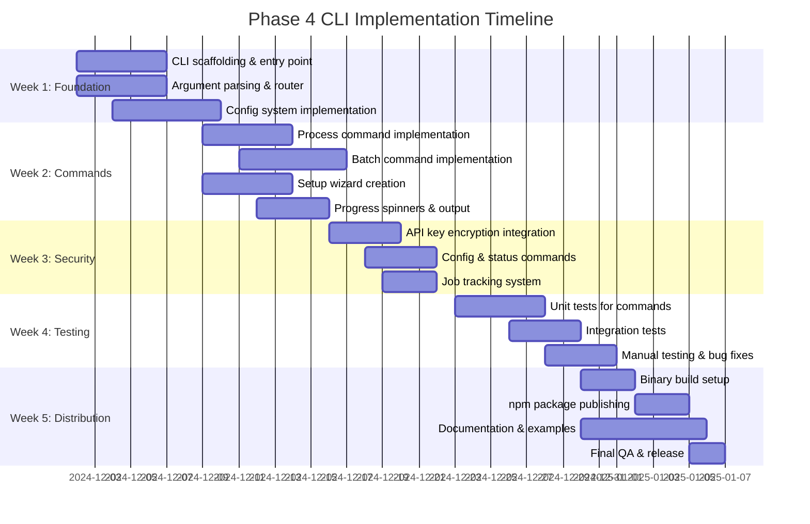

# Phase 4: CLI Implementation Roadmap

## Overview

**Project**: Obsidianize - Dual-Target AI Content Processing Platform
**Phase**: 4 - Native Terminal CLI Interface
**Status**: Planning & Specification
**Last Updated**: November 27, 2025

---

## Phase 4 Vision

### Goals and Objectives

Phase 4 transforms Obsidianize into a complete native terminal tool while leveraging the production-proven core infrastructure built in Phases 1-3. The CLI will provide terminal power users and developers with lightning-fast access to intelligent content processing.

**Primary Objectives**:
- Create a native CLI matching Web TUI feature parity
- Achieve sub-100ms startup time through Bun's runtime
- Implement secure, persistent local configuration
- Enable batch processing workflows with terminal integration
- Support piping and shell scripting
- Deliver distribution-ready binaries for all platforms

### How CLI Complements Web TUI

```
┌─────────────────────────────────────────────────────┐
│         Google Gemini AI Processing Engine           │
│      (Shared Core: src/core/ - Already Built)       │
└─────────────────────────────────────────────────────┘
                          △
                ┌─────────┴─────────┐
                │                   │
    ┌───────────▼────────┐  ┌──────▼──────────────┐
    │   Web TUI Interface│  │  CLI Interface      │
    │   (Phase 2-3 Done) │  │  (Phase 4 Target)   │
    │                    │  │                     │
    │ • Browser-based    │  │ • Terminal-based    │
    │ • Visual feedback  │  │ • Speed optimized   │
    │ • Rich UI          │  │ • Scriptable        │
    │ • Cross-platform   │  │ • Batch processing  │
    └────────────────────┘  └─────────────────────┘
```

### Target Users

1. **Developers & Researchers**: Building automation around content processing
2. **Terminal Power Users**: Those who prefer CLI tools over web interfaces
3. **DevOps/SRE Teams**: Integrating into documentation workflows
4. **Academic Users**: Batch processing papers and research materials
5. **Content Creators**: Automating note-taking for video/article workflows

---

## CLI Features

### 1. `obsidianize process <url>`

**Purpose**: Process a single URL and output to file or stdout

**Usage**:
```bash
# Basic usage
obsidianize process "https://www.youtube.com/watch?v=example"

# Save to specific location
obsidianize process "https://example.com/article" -o ~/notes/

# Specify output format
obsidianize process "https://example.com" --format json

# Summarization levels
obsidianize process "https://youtube.com/..." --summary brief
obsidianize process "https://youtube.com/..." --summary comprehensive

# Display in terminal
obsidianize process "https://example.com" --stdout

# Verbose output
obsidianize process "https://example.com" --verbose
```

**Options**:
| Option | Short | Description | Default |
|--------|-------|-------------|---------|
| `--output` | `-o` | Output directory or file | Current dir |
| `--format` | | markdown, json, yaml | markdown |
| `--summary` | | brief, standard, detailed, comprehensive | standard |
| `--mode` | | standard, enhanced, academic | standard |
| `--stdout` | | Print to terminal | false |
| `--verbose` | `-v` | Detailed output | false |
| `--quiet` | `-q` | Minimal output | false |
| `--overwrite` | | Overwrite existing files | false |

### 2. `obsidianize batch <file>`

**Purpose**: Process multiple URLs from a file

**Usage**:
```bash
# Basic batch processing
obsidianize batch urls.txt

# With concurrency control
obsidianize batch urls.txt --concurrent 5

# Save to specific directory
obsidianize batch urls.json --output ~/batch-results/

# Resume from checkpoint
obsidianize batch urls.txt --resume last-run-id

# Generate report
obsidianize batch urls.txt --report detailed

# Dry run (validate only)
obsidianize batch urls.txt --dry-run
```

**Input File Formats**:

Text file (one URL per line):
```
https://www.youtube.com/watch?v=example1
https://example.com/article-1
https://example.com/article-2
```

JSON file with options:
```json
{
  "urls": [
    { "url": "https://youtube.com/...", "summary": "brief" },
    { "url": "https://example.com/...", "prompt": "Focus on key points" }
  ],
  "batch": {
    "concurrent": 3,
    "timeout": 600
  }
}
```

**Options**:
| Option | Description | Default |
|--------|-------------|---------|
| `--concurrent` | Parallel workers (1-10) | 3 |
| `--timeout` | Timeout per URL (seconds) | 600 |
| `--output` | Output directory | Current dir |
| `--report` | Report type: summary, detailed, json | none |
| `--dry-run` | Validate without processing | false |
| `--resume` | Resume from batch ID | none |
| `--stop-on-error` | Halt on first error | false |

### 3. `obsidianize config`

**Purpose**: Manage API keys, defaults, and settings

**Subcommands**:
```bash
# View configuration
obsidianize config list

# Get specific value
obsidianize config get gemini.api-key
obsidianize config get defaults.output-format

# Set value
obsidianize config set gemini.api-key "AIza..."
obsidianize config set defaults.summary brief

# Delete key
obsidianize config delete gemini.api-key

# Validate configuration
obsidianize config validate

# Reset to defaults
obsidianize config reset

# Show config path
obsidianize config path
```

**Configuration Schema**:
```json
{
  "gemini": {
    "apiKey": "ENCRYPTED_VALUE"
  },
  "defaults": {
    "outputFormat": "markdown",
    "outputDirectory": "~/Obsidianize",
    "summaryLevel": "standard",
    "concurrent": 3
  },
  "display": {
    "verbose": false,
    "showProgress": true
  }
}
```

### 4. `obsidianize status <job-id>`

**Purpose**: Check status of batch jobs

**Usage**:
```bash
# Check status
obsidianize status batch-2024-11-27-abc123

# Watch in real-time
obsidianize status batch-id --watch

# Export job data
obsidianize status batch-id --export job.json
```

**Output**:
```
Job ID: batch-2024-11-27-abc123
Status: Running
Started: 2024-11-27 14:32:15
Duration: 4 minutes 23 seconds

Progress: ████████░░ 80%
- Completed: 80/100
- Failed: 2
- Pending: 18
```

### 5. `obsidianize setup` (Interactive Wizard)

**Purpose**: First-time user setup

**Flow**:
```
╔════════════════════════════════════════════╗
║  Welcome to Obsidianize CLI Setup!         ║
╚════════════════════════════════════════════╝

Step 1: Gemini API Key Setup
────────────────────────────
? Enter your API key: [encrypted input]
? Store securely? (Y/n): Y

Step 2: Default Preferences
──────────────────────────
? Default output format? (markdown):
? Default summary level? (standard):
? Concurrent batch jobs? (3):

Step 3: Verification
──────────────────────
Testing API key...
✓ API key is valid!

✓ Setup complete!
  Config saved to: ~/.obsidianize/config.json
```

---

## Technical Components

### Directory Structure

```
src/cli/
├── index.ts                    # CLI entry point
├── commands/
│   ├── index.ts               # Command exports
│   ├── process.ts             # process <url> command
│   ├── batch.ts               # batch <file> command
│   ├── config.ts              # config command
│   ├── status.ts              # status <job-id> command
│   └── setup.ts               # Interactive setup wizard
├── interactive/
│   ├── prompts.ts             # Interactive prompts
│   ├── wizard.ts              # Setup wizard
│   └── progress.ts            # Terminal spinners
├── output/
│   ├── formatters.ts          # Terminal output formatting
│   ├── colors.ts              # Chalk color definitions
│   └── tables.ts              # ASCII table rendering
├── config/
│   ├── file-handler.ts        # Config file I/O
│   ├── validator.ts           # Config validation
│   └── schema.ts              # Config schema
├── utils/
│   ├── file-utils.ts          # File operations
│   ├── error-formatter.ts     # CLI error display
│   └── path-resolver.ts       # Path resolution
└── bin/
    └── obsidianize.ts         # Executable entry point
```

### Argument Parsing Strategy

**Decision**: Native Bun + TypeScript (no heavy framework)

**Rationale**:
- Sub-100ms startup requirement
- Minimal dependencies
- Full control over parsing logic
- Type-safe argument handling

**Alternative**: commander.js if more complex validation needed

### Configuration File

**Location**: `~/.obsidianize/config.json`
**Permissions**: `0600` (owner read/write only)

```json
{
  "version": "1.0.0",
  "gemini": {
    "apiKey": "ENCRYPTED_AES_GCM_VALUE",
    "apiKeyLastSet": "2024-11-27T14:32:15Z"
  },
  "defaults": {
    "outputFormat": "markdown",
    "outputDirectory": "/Users/username/Obsidianize",
    "summaryLevel": "standard",
    "analysisMode": "standard",
    "concurrent": 3
  },
  "display": {
    "verbose": false,
    "showProgress": true
  }
}
```

### Secure API Key Storage

**Encryption Method**: Reuse Web TUI's `src/web/security/encryption.ts`

- **Algorithm**: AES-256-GCM
- **Key Derivation**: PBKDF2 with 100,000 iterations
- **File Permissions**: 0600 (owner only)
- **Memory Management**: Clear after use

**Environment Variable Fallback**: `OBSIDIANIZE_API_KEY` for CI/CD

---

## Shared Core Integration

### Reused Components

| Module | Location | CLI Usage |
|--------|----------|-----------|
| **Processor** | `src/core/processor.ts` | All commands |
| **AI Engine** | `src/core/ai/*` | Content processing |
| **Validators** | `src/core/validators/*` | Input validation |
| **Cache** | `src/core/cache/cache.ts` | Result caching |
| **Rate Limiter** | `src/core/rate-limit/*` | Concurrency control |
| **File Operations** | `src/core/storage/*` | File I/O |
| **Formatters** | `src/core/formatters/*` | Output formatting |
| **Logger** | `src/core/logging/*` | Structured logging |
| **Config** | `src/core/config/*` | Configuration |
| **Errors** | `src/core/errors/*` | Error handling |

### AppContext Integration

```typescript
import { AppContext, initializeApp } from '../core/app-context.ts';

// Initialize with CLI-specific config
const context = await initializeApp({
  name: 'Obsidianize-CLI',
  version: '1.0.0',
  environment: 'production',
  logLevel: cliConfig.display.verbose ? 'debug' : 'info'
});

// Get services
const logger = context.getLogger('process-command');
const cache = context.getCache();
const rateLimiter = context.getRateLimiter();
```

### Error Handling

```typescript
import {
  ObsidianizeError,
  ValidationError,
  NetworkError
} from '../core/errors/index.ts';

try {
  await processContent(...);
} catch (error) {
  if (error instanceof ValidationError) {
    console.error(`Validation failed: ${error.message}`);
    process.exit(7);
  } else if (error instanceof NetworkError) {
    console.error(`Network error: ${error.message}`);
    process.exit(5);
  }
}
```

---

## Implementation Roadmap

### Timeline Gantt Chart



### Week-by-Week Breakdown

#### Week 1: CLI Scaffolding & Foundation

**Deliverables**:
- [ ] Create `src/cli/` directory structure
- [ ] Implement CLI entry point (`src/cli/index.ts`)
- [ ] Build argument parser
- [ ] Create command router
- [ ] Set up configuration loading

**Acceptance Criteria**:
- CLI runs: `bun src/cli/index.ts --help`
- Arguments correctly parsed
- Configuration loads default values

#### Week 2: Core Commands

**Deliverables**:
- [ ] Implement `process <url>` command
- [ ] Implement `batch <file>` command
- [ ] Add progress display system
- [ ] Setup wizard implementation

**Acceptance Criteria**:
- `obsidianize process "url"` works end-to-end
- Batch processing handles multiple URLs
- Progress displays in real-time
- Setup wizard guides new users

#### Week 3: Security & Configuration

**Deliverables**:
- [ ] API key encryption integration
- [ ] Secure file permission enforcement
- [ ] Configuration validation
- [ ] Status command implementation
- [ ] Job tracking system

**Acceptance Criteria**:
- API key stored encrypted
- Config file has 0600 permissions
- Job status queryable

#### Week 4: Testing & Quality

**Deliverables**:
- [ ] Unit tests for all commands (>80% coverage)
- [ ] Integration tests for workflows
- [ ] Manual testing checklist
- [ ] Performance optimization

**Test Structure**:
```
tests/cli/
├── unit/
│   ├── commands/
│   │   ├── process.test.ts
│   │   ├── batch.test.ts
│   │   └── config.test.ts
│   └── config/
│       └── validator.test.ts
├── integration/
│   ├── process-workflow.test.ts
│   └── batch-workflow.test.ts
└── e2e/
    └── setup-wizard.test.ts
```

#### Week 5: Distribution & Release

**Deliverables**:
- [ ] Build binary artifacts
- [ ] npm package configuration
- [ ] Installation documentation
- [ ] Cross-platform testing

**Distribution Formats**:
- Standalone Bun binary
- npm package (`obsidianize`)
- Homebrew formula (optional)

---

## Technical Specifications

### Command Reference

```
USAGE
  obsidianize <command> [options]

COMMANDS
  process <url>     Process a single URL
  batch <file>      Batch process URLs from file
  config            Manage configuration
  status <job-id>   Check job status
  setup             Interactive setup wizard

GLOBAL OPTIONS
  -h, --help        Show help
  -v, --version     Show version
  --verbose         Verbose output
  --quiet           Minimal output

EXAMPLES
  obsidianize process https://youtube.com/watch?v=...
  obsidianize batch urls.txt --concurrent 5
  obsidianize config set gemini.api-key "AIza..."
```

### Exit Codes

| Code | Meaning |
|------|---------|
| 0 | Success |
| 1 | General error |
| 2 | Usage error |
| 3 | Configuration error |
| 4 | API/Processing error |
| 5 | Network error |
| 6 | File I/O error |
| 7 | Validation error |
| 8 | Authentication error |

### Environment Variables

```bash
OBSIDIANIZE_CONFIG_PATH    # Custom config directory
OBSIDIANIZE_API_KEY        # API key (development)
OBSIDIANIZE_VERBOSE        # Enable verbose output
NODE_ENV                   # Environment mode
```

### Output Formatting

```
╔════════════════════════════════════════════════════════════╗
║              Obsidianize CLI v1.0.0                        ║
╚════════════════════════════════════════════════════════════╝

Processing: https://www.youtube.com/watch?v=example
Status: Fetching content...

[████████░░░░░░░░░░░░░░░░░░░░] 30% | 2.3s

✓ Complete! (7.34s)

Output: /Users/username/notes/example-2024-11-27.md
Size: 2.3 KB
```

---

## Testing Strategy

### Unit Tests

- Test individual command implementations
- Mock external dependencies
- Minimum 80% code coverage

### Integration Tests

- Full command workflows
- Configuration persistence
- File I/O operations

### Manual Testing Checklist

```markdown
## Process Command
- [ ] Single URL with markdown output
- [ ] Single URL with JSON output
- [ ] Output to specific directory
- [ ] Invalid URL handling
- [ ] API error handling
- [ ] All summary levels work

## Batch Command
- [ ] Text file with URLs
- [ ] JSON file with options
- [ ] Concurrent processing
- [ ] Resume from checkpoint
- [ ] Stop on error behavior

## Config Command
- [ ] List all values
- [ ] Get/Set specific values
- [ ] Validate config
- [ ] Reset to defaults

## Setup Wizard
- [ ] First run detection
- [ ] API key validation
- [ ] Config file creation
```

---

## Distribution Plan

### Installation Methods

**1. npm/Bun Installation**:
```bash
npm install -g obsidianize
# or
bun install -g obsidianize

obsidianize setup
```

**2. Direct Binary Download**:
```bash
# Download from releases
wget https://github.com/.../releases/download/v1.0.0/obsidianize-linux-x64
chmod +x obsidianize-linux-x64
./obsidianize-linux-x64 process https://example.com
```

**3. From Source**:
```bash
git clone https://github.com/AmbitiousRealism2025/Obsidianize-TUI_SIM.git
cd Obsidianize-TUI_SIM
bun install
bun run src/cli/index.ts process https://example.com
```

### Platform Support

| Platform | Architecture | Binary |
|----------|--------------|--------|
| macOS | arm64 (M1+) | obsidianize-macos-arm64 |
| macOS | x64 (Intel) | obsidianize-macos-x64 |
| Linux | x64 | obsidianize-linux-x64 |
| Linux | arm64 | obsidianize-linux-arm64 |
| Windows | x64 | obsidianize-windows-x64.exe |

### Build Process

```bash
# Build for current platform
bun build ./src/cli/bin/obsidianize.ts \
  --outdir ./dist \
  --target bun \
  --minify

# Make executable
chmod +x ./dist/obsidianize
```

---

## Success Criteria

### Technical Metrics

| Metric | Target | Verification |
|--------|--------|--------------|
| **Startup Time** | <100ms | `time obsidianize --help` |
| **Memory Baseline** | <50MB | `ps aux` |
| **Code Coverage** | >80% | `bun test --coverage` |
| **Binary Size** | <50MB | `ls -lh dist/` |

### Feature Completeness

- [ ] `obsidianize process <url>` - fully functional
- [ ] `obsidianize batch <file>` - fully functional
- [ ] `obsidianize config` - all subcommands working
- [ ] `obsidianize status <id>` - fully functional
- [ ] `obsidianize setup` - wizard complete

### Quality Gates

Before Release:
1. ✓ All tests passing (unit + integration)
2. ✓ Code coverage >80%
3. ✓ No TypeScript errors
4. ✓ Performance targets met
5. ✓ Security review passed
6. ✓ Cross-platform testing completed
7. ✓ Documentation complete

---

## Acceptance Criteria

Concrete, testable acceptance criteria for Phase 4 CLI implementation.

### AC-1: CLI Installation & Setup

- [ ] `bun install -g obsidianize` successfully installs the CLI
- [ ] `obsidianize --version` outputs semantic version (e.g., `1.0.0`)
- [ ] `obsidianize --help` displays all available commands with descriptions
- [ ] First run without config prompts for API key setup
- [ ] `obsidianize setup` launches interactive wizard

### AC-2: Single URL Processing

- [ ] `obsidianize process <youtube-url>` returns markdown within 30s
- [ ] `obsidianize process <article-url>` extracts content correctly
- [ ] Output file follows naming convention: `YYYY-MM-DD_Title.md`
- [ ] `--output` flag saves to specified directory
- [ ] `--format json` produces valid JSON output
- [ ] `--format yaml` produces valid YAML output
- [ ] `--stdout` prints result to terminal instead of file
- [ ] Exit code 0 on success, non-zero on failure
- [ ] All `--summary` levels work: brief, standard, detailed, comprehensive

### AC-3: Batch Processing

- [ ] `obsidianize batch urls.txt` processes all URLs from text file
- [ ] `obsidianize batch urls.json` processes URLs with per-item options
- [ ] `--concurrent N` controls parallel workers (1-10)
- [ ] Progress indicator shows completion percentage
- [ ] Failed URLs logged but don't stop batch (unless `--stop-on-error`)
- [ ] Summary report at end shows success/fail counts
- [ ] `--dry-run` validates URLs without processing
- [ ] `--resume <batch-id>` continues from checkpoint

### AC-4: Configuration Management

- [ ] `obsidianize config set gemini.api-key <key>` stores encrypted key
- [ ] `obsidianize config get gemini.api-key` shows masked key (e.g., `AIza...xxxx`)
- [ ] `obsidianize config list` displays all configuration values
- [ ] `obsidianize config validate` verifies configuration integrity
- [ ] `obsidianize config reset` restores default values
- [ ] `obsidianize config path` shows config file location
- [ ] Config file location: `~/.obsidianize/config.json`
- [ ] File permissions set to 600 (owner read/write only)
- [ ] Environment variable `OBSIDIANIZE_API_KEY` overrides config file

### AC-5: Job Status & Monitoring

- [ ] `obsidianize status <batch-id>` shows job progress
- [ ] `--watch` flag updates status in real-time
- [ ] Status includes: completed count, failed count, pending count
- [ ] `--export job.json` saves job data to file

### AC-6: Performance Requirements

- [ ] Cold start time < 100ms (measured via `time obsidianize --help`)
- [ ] Memory usage < 50MB baseline (measured via `ps aux`)
- [ ] Single URL processing < 30s (excluding network latency)
- [ ] Binary size < 50MB

### AC-7: Error Handling

- [ ] Invalid URL shows helpful error message with example format
- [ ] Network timeout shows retry suggestion
- [ ] Invalid API key shows setup instructions
- [ ] Rate limit exceeded shows wait time
- [ ] All errors include error codes for scripting (exit codes 1-8)
- [ ] `--verbose` flag provides detailed error context
- [ ] Errors written to stderr, success output to stdout

### AC-8: Cross-Platform Compatibility

- [ ] Works on macOS (arm64 and x64)
- [ ] Works on Linux (x64 and arm64)
- [ ] Works on Windows (x64)
- [ ] Binary artifacts build for all platforms
- [ ] npm package installs correctly on all platforms

---

## Future Enhancements (Post Phase 4)

### Phase 4.1 (Polish)
- Homebrew formula for macOS
- Chocolatey package for Windows
- Snap package for Linux
- Shell completion scripts (bash, zsh, fish)

### Phase 5 (Advanced)
- Plugin system for custom commands
- TUI mode for interactive navigation
- Offline mode with local model support
- Advanced batch scheduling
- Cloud sync for configurations

---

## Summary

Phase 4 CLI Implementation will deliver:

- **5 Core Commands**: process, batch, config, status, setup
- **Full Feature Parity**: All Web TUI capabilities in terminal
- **Sub-100ms Startup**: Leveraging Bun's performance
- **Secure Storage**: Encrypted API key management
- **Cross-Platform**: macOS, Linux, Windows support
- **Distribution**: npm package + standalone binaries

**Estimated Timeline**: 5 weeks
**Estimated Effort**: 230-280 hours

---

**Document Status**: Complete and Ready for Implementation
**Last Updated**: November 27, 2025
