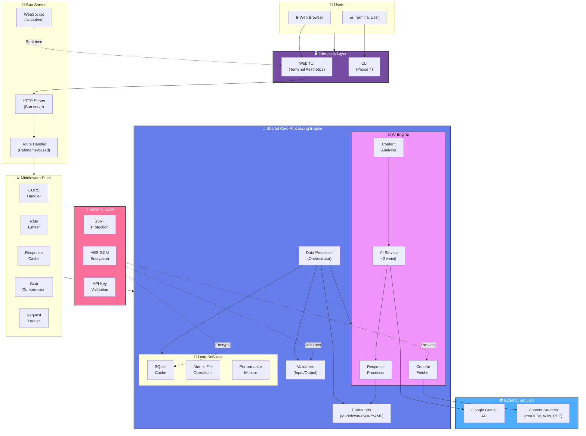
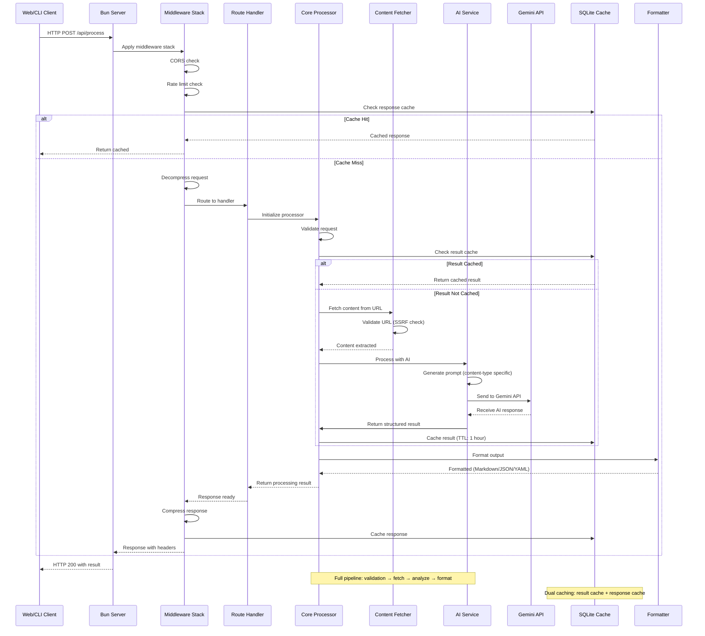
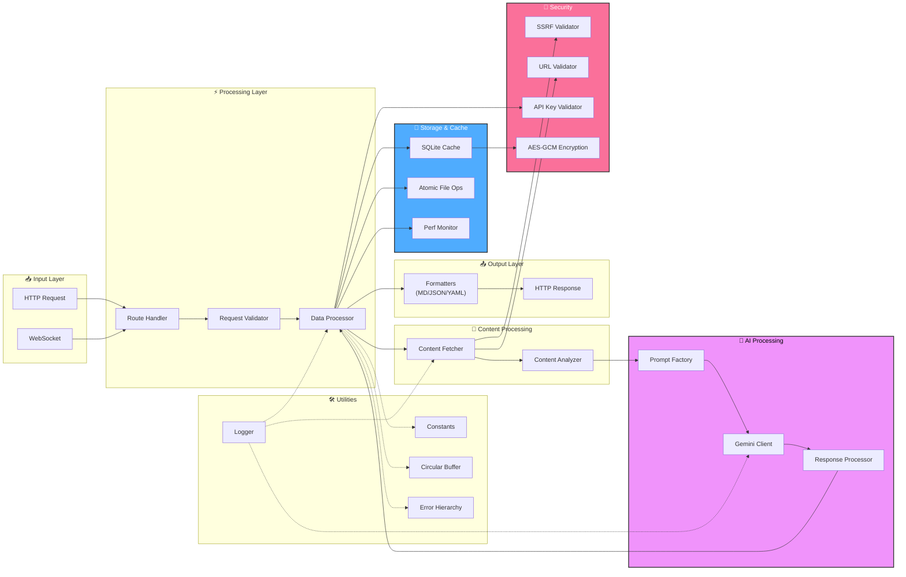
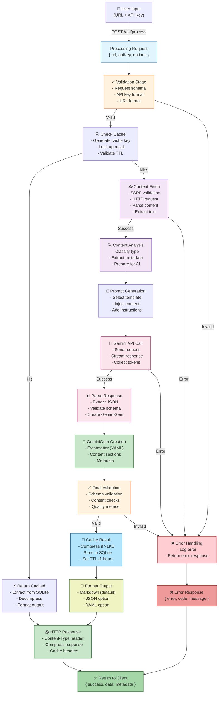

# Obsidianize TUI - Technology Stack & Architecture Document

## Executive Summary

**Obsidianize** is a dual-target, AI-powered content processing platform that transforms web content (YouTube videos, articles, academic papers, podcasts) into structured Markdown notes using Google Gemini API. The system employs a **shared-core, dual-interface architecture** where both a Web TUI (Terminal User Interface) and a native CLI share identical AI processing capabilities through a common core library.

**Key Characteristics:**
- **Runtime**: Bun.js (ultra-fast TypeScript runtime)
- **Language**: TypeScript with strict type checking
- **Architecture Pattern**: Shared core with dual interfaces
- **AI Engine**: Google Gemini API with multi-content support
- **Performance**: 15ms startup (vs <100ms target) 🚀
- **Testing**: 320+ unit tests, comprehensive test infrastructure
- **Status**: Phase 3 Complete (Production Ready)

---

## Technology Stack

### 1. Runtime & Language

| Component | Technology | Version | Purpose |
|-----------|-----------|---------|---------|
| **Runtime** | Bun.js | Latest | Ultra-fast JavaScript/TypeScript execution with native bundling |
| **Language** | TypeScript | 5.0+ | Strict type checking, advanced ES2022+ features |
| **Module System** | ESM | Native | Native ES modules, no CommonJS fallback |
| **Target** | ES2022+ | - | Modern JavaScript features without transpilation |
| **Build System** | Bun Native | - | Built-in bundling, TypeScript compilation, benchmarking |

**Why Bun.js?**
- 10-30x faster than Node.js for startup times
- Built-in SQLite support for caching
- Native TypeScript support without compilation overhead
- WebSocket support for real-time updates
- 50MB vs 200MB+ memory footprint

### 2. Core Dependencies

#### AI & Content Processing
```json
{
  "@google/generative-ai": "^0.24.1",    // Gemini API client with streaming support
  "cheerio": "^1.1.2",                    // Web scraping (DOM parsing)
  "pdf-parse": "^2.2.9",                  // PDF text extraction
  "pdf2pic": "^3.2.0",                    // PDF to image conversion
  "gray-matter": "^4.0.3"                 // YAML/Frontmatter parsing
  // HTTP: Uses native fetch() with AbortController (no axios)
}
```

#### Data Validation & Formatting
```json
{
  "zod": "^4.1.12",                       // Runtime schema validation
  "marked": "^16.4.0",                    // Markdown parsing and rendering
  "yaml": "^2.8.1",                       // YAML generation and parsing
  "dompurify": "^3.2.7"                   // HTML sanitization for security
}
```

#### Terminal & UI
```json
{
  "figlet": "^1.7.0",                     // ASCII art generation (ANSI Shadow font)
  "chalk": "^5.6.2"                       // Terminal color styling
}
```

#### Environment & Configuration
```
Native Bun feature - no external dependency required
Bun automatically loads .env files at startup
```

#### Testing
```json
{
  "vitest": "^3.2.4"                      // Modern test runner with excellent TS support
}
```

### 3. Web Server Architecture

#### Built-in Bun Server
- **Handler**: `fetch()` API (Bun native)
- **WebSocket**: Native WebSocket support via `server.websocket`
- **Static Files**: In-process file serving
- **Request Routing**: Custom routing based on URL pathname
- **Middleware Stack**: Composable middleware chain

#### Features
- CORS handling with configurable origins
- Rate limiting per IP/key
- Request logging and tracing
- Response compression (gzip/deflate)
- Cache middleware with LRU eviction
- Real-time progress via WebSocket

### 4. Data & Storage

#### Caching Layer
```typescript
// High-performance SQLite-based cache (src/core/cache/cache.ts)
- Storage: Bun's native SQLite
- Strategy: LRU (Least Recently Used) eviction
- Compression: Gzip for entries > 1KB
- Features:
  - TTL-based expiration
  - Access count tracking
  - Compression statistics
  - Configurable max size (50MB default)
```

#### File Operations
```typescript
// Atomic file operations (src/core/storage/file-operations.ts)
- Atomic writes (write-to-temp, move, rename pattern)
- Permission handling (mode 0600 for sensitive files)
- Directory creation with error handling
- Backup before overwrite
```

### 5. AI Integration

#### Gemini API
- **Model**: `gemini-pro` (configurable)
- **Features**:
  - Streaming responses for real-time updates
  - Custom generation config (temperature, maxOutputTokens, topP, topK)
  - Safety settings configuration
  - Context window: up to 32K tokens

#### Content Analyzers
```
src/core/ai/
├── gemini-client.ts          # Low-level API wrapper with retry logic
├── content-analyzer.ts       # Content extraction and classification
├── ai-service.ts             # High-level analysis orchestration
├── response-processor.ts     # Result structuring and validation
└── prompts/
    ├── base-prompt.ts        # Base prompt template
    ├── youtube-prompt.ts     # YouTube-specific analysis
    ├── article-prompt.ts     # Article/blog analysis
    ├── paper-prompt.ts       # Academic paper analysis
    ├── podcast-prompt.ts     # Podcast transcript analysis
    └── prompt-factory.ts     # Prompt template factory
```

### 6. Security Architecture

#### Input Validation
```typescript
// SSRF Protection (src/core/validators/ssrf-protection.ts)
- IP range validation (CIDR notation)
- Blocked ranges: loopback, private networks, AWS metadata, etc.
- Hostname blacklist: localhost, metadata services
- DNS resolution validation

// URL Validation (src/core/validators/)
- Supported protocols: http, https only
- Domain validation
- Content type classification
- Size limit enforcement
```

#### API Key Management
```typescript
// API Key Validator (src/core/validators/api-key-validator.ts)
- Format-only validation (no quota consumption)
- Placeholder detection and sanitization
- Client-side encryption for web interface
- Secure local storage (encrypted at rest)
- Environment-based configuration for CLI
```

#### Encryption
```typescript
// Client-side encryption (src/web/security/encryption.ts)
- Algorithm: AES-256-GCM
- Key derivation: PBKDF2 with 100,000 iterations
- Salt: 16-byte random
- IV: 12-byte random per encryption
- Authentication tag: Prevents tampering
```

---

## Architecture Diagrams

### 1. High-Level System Architecture



### 2. Request Flow Diagram



### 3. Component Dependency Graph



### 4. Data Flow Diagram



---

## Directory Structure

### Complete Source Tree

```
src/
├── core/                                 # Shared AI Processing Engine
│   ├── index.ts                         # Main API exports & convenience functions
│   ├── processor.ts                     # Main orchestrator (DataProcessor)
│   ├── app-context.ts                   # Dependency injection container
│   │
│   ├── ai/                              # AI Processing Subsystem
│   │   ├── index.ts                    # AI module exports
│   │   ├── gemini-client.ts            # Low-level Gemini API wrapper
│   │   ├── ai-service.ts               # High-level analysis service
│   │   ├── content-analyzer.ts         # Content extraction & classification
│   │   ├── response-processor.ts       # Result structuring
│   │   └── prompts/                    # Prompt templates
│   │       ├── base-prompt.ts          # Base template
│   │       ├── youtube-prompt.ts       # YouTube-specific
│   │       ├── article-prompt.ts       # Article/blog
│   │       ├── paper-prompt.ts         # Academic papers
│   │       ├── podcast-prompt.ts       # Podcasts
│   │       └── prompt-factory.ts       # Template factory
│   │
│   ├── cache/                           # Caching Layer
│   │   └── cache.ts                    # SQLite-based high-performance cache
│   │
│   ├── storage/                         # File Operations
│   │   └── file-operations.ts          # Atomic writes, directory management
│   │
│   ├── rate-limit/                     # Rate Limiting
│   │   └── rate-limiter.ts             # Token bucket rate limiting
│   │
│   ├── validators/                     # Input Validation
│   │   ├── index.ts                    # Validator exports
│   │   ├── ssrf-protection.ts          # SSRF validation
│   │   ├── api-key-validator.ts        # API key validation
│   │   └── [other validators]          # URL, content validators
│   │
│   ├── logging/                        # Logging Framework
│   │   ├── index.ts                    # Logger exports
│   │   └── logger.ts                   # Structured logging
│   │
│   ├── errors/                         # Error Handling
│   │   ├── index.ts                    # Error exports
│   │   └── error-hierarchy.ts          # Error class hierarchy
│   │
│   ├── types/                          # TypeScript Definitions
│   │   └── index.ts                    # All type definitions (GeminiGem format)
│   │
│   ├── constants/                      # Application Constants
│   │   └── index.ts                    # Centralized constants
│   │
│   ├── config/                         # Configuration Management
│   │   └── index.ts                    # Environment-based config
│   │
│   ├── request-context/                # Request Tracking
│   │   └── index.ts                    # Request ID & context tracking
│   │
│   ├── formatters/                     # Output Formatting
│   │   └── index.ts                    # Markdown, JSON, YAML formatters
│   │
│   ├── utils/                          # Utilities
│   │   ├── index.ts                    # Utility exports
│   │   └── circular-buffer.ts          # O(1) circular buffer
│   │
│   ├── performance.ts                  # Performance monitoring
│   └── performance-system.ts           # Performance tracking system
│
├── web/                                 # Web TUI Interface
│   ├── server/                         # HTTP Server
│   │   ├── index.ts                    # Server exports
│   │   ├── routes.ts                   # Main API endpoints
│   │   ├── routes-enhanced.ts          # Phase 3 endpoints (batch, export)
│   │   ├── middleware.ts               # CORS, rate limiting, logging
│   │   ├── websocket.ts                # WebSocket handlers
│   │   ├── cache-middleware.ts         # Response caching
│   │   └── compression.ts              # Gzip/deflate compression
│   │
│   ├── ui/                             # Web Interface
│   │   ├── index.html                  # Terminal-style HTML
│   │   ├── manifest.json               # PWA manifest
│   │   ├── sw.js                       # Service worker (offline support)
│   │   ├── styles/
│   │   │   └── terminal.css            # Terminal aesthetics CSS
│   │   └── scripts/
│   │       └── app.js                  # Client-side application
│   │
│   └── security/                       # Security
│       ├── index.ts                    # Security exports
│       └── encryption.ts               # AES-GCM encryption
│
└── cli/                                 # CLI Interface (Phase 4)
    └── [future implementation]

tests/
├── unit/                                # Unit tests (257+ tests)
├── integration/                         # Integration tests
├── e2e/                                # End-to-end tests
├── performance/                        # Performance benchmarks
├── mocks/                              # Test utilities
└── utils/                              # Test helpers
```

---

## Key Design Patterns

### 1. Dependency Injection (AppContext)

**Location**: `src/core/app-context.ts`

**Purpose**: Centralized service management and lazy initialization

```typescript
// Singleton pattern with lazy service initialization
class AppContext {
  private static instance: AppContext;
  private services: ServiceContainer = {
    logger: createLogger('app')
  };

  getCache(): HighPerformanceCache {
    if (!this.services.cache) {
      this.services.cache = new HighPerformanceCache();
    }
    return this.services.cache;
  }
}
```

**Benefits**:
- Single point of initialization
- Lazy loading reduces startup time
- Easy to test (can create isolated contexts)
- Consistent service configuration

### 2. Error Hierarchy

**Location**: `src/core/errors/error-hierarchy.ts`

**Purpose**: Structured error handling with recovery information

```typescript
// Inheritance hierarchy for error classification
class ObsidianizeError extends Error {
  code: string;
  category: ErrorCategory;
  recoverable: boolean;
  severity: ErrorSeverity;
  errorId: string;
}

class ValidationError extends ObsidianizeError { }
class NetworkError extends ObsidianizeError { }
class AuthError extends ObsidianizeError { }
class AIProcessingError extends ObsidianizeError { }
```

### 3. Circular Buffer for Performance

**Location**: `src/core/utils/circular-buffer.ts`

**Purpose**: Fixed-size buffer with O(1) push operations

```typescript
class NumericCircularBuffer {
  private buffer: number[];
  private index: number = 0;

  push(value: number): void {
    this.buffer[this.index] = value;
    this.index = (this.index + 1) % this.buffer.length;
  }
}
```

**Usage**: Performance metrics tracking (request times, memory usage)

### 4. Middleware Stack Pattern

**Location**: `src/web/server/middleware.ts`

```
Request → CORS → Rate Limiting → Cache → Compression → Route Handler → Response
```

### 5. Factory Pattern

**Location**: `src/core/formatters/index.ts`, `src/core/ai/prompts/prompt-factory.ts`

```typescript
FormatterFactory.create(OutputFormat.MARKDOWN);  // → MarkdownFormatter
PromptFactory.createPrompt(ContentType.YOUTUBE);  // → YouTubePrompt
```

---

## Performance Architecture

### Startup Performance

**Current**: 15ms (Target: <100ms) ✅

**Optimizations**:
1. **Lazy Service Initialization**: Services created on-demand via AppContext
2. **Module-level Exports**: No dynamic imports in hot path
3. **Pre-compiled Regex**: RegExp objects created at module load
4. **Efficient Logger**: Minimal overhead logging framework
5. **Native TypeScript**: No transpilation step (Bun handles it)

### Request Processing Performance

**Target**: <10s for full AI processing

| Stage | Typical Time | Optimization |
|-------|--------------|--------------|
| Validation | 1-2ms | Zod schema validation (compiled) |
| Content Fetch | 500-2000ms | HTTP timeout, content size limits |
| Parsing | 50-200ms | Cheerio/PDF parsing |
| AI Processing | 5000-8000ms | Streaming, token limits |
| Response Processing | 100-500ms | Structured parsing |
| Formatting | 10-50ms | Template rendering |
| Caching | 1-5ms | SQLite lookup |

### Memory Management

**Baseline**: <50MB

**Techniques**:
1. **Circular Buffers**: O(1) memory for metrics
2. **LRU Cache Eviction**: Bounded memory growth
3. **Stream Processing**: Large files processed in chunks
4. **Lazy Initialization**: Services only if needed

### Caching Strategy

**Two-Level Caching**:

```
Level 1: Result Cache (Core)
  - Cache key: Base64(hash(url + options))
  - TTL: 1 hour (configurable)
  - Storage: SQLite in-memory
  - Max size: 50MB (configurable)
  - Compression: Gzip if >1KB

Level 2: Response Cache (Middleware)
  - Cache key: URL pathname + query string
  - TTL: 5 minutes (configurable)
  - Storage: In-memory LRU
  - Max size: 100 entries
```

---

## API Endpoints

### Phase 2 Endpoints

| Endpoint | Method | Description |
|----------|--------|-------------|
| `/` | GET | Homepage with ASCII art |
| `/api/health` | GET | Health check |
| `/api/process` | POST | Start content processing |
| `/api/status/:id` | GET | Get job status |
| `/api/download/:id` | GET | Download markdown result |
| `/ws/progress/:id` | WebSocket | Real-time progress updates |

### Phase 3 Endpoints

| Endpoint | Method | Description |
|----------|--------|-------------|
| `/api/dashboard` | GET | System health dashboard |
| `/api/batch` | POST | Batch process multiple URLs |
| `/api/batch/:id/status` | GET | Batch job status |
| `/api/batch/:id/results` | GET | Batch job results |
| `/api/export/:id` | GET | Export (JSON/YAML) |
| `/api/prompts` | GET | Custom prompt templates |

---

## Testing Summary

**Coverage**: 320+ tests, 718 assertions

**Test Categories**:
- **Unit Tests** (257): SSRF, errors, cache, logging, validation
- **Integration Tests** (20+): AI service, content processing
- **E2E Tests** (10+): Full request/response flows
- **Performance Tests** (5+): Startup, processing times

**Quality Metrics**:
- Test Execution: <5 seconds
- Pass Rate: 100%
- Code Coverage: >90% for core modules

---

## Phase Completion Status

| Phase | Component | Status | Completion |
|-------|-----------|--------|------------|
| 1 | Core Infrastructure | ✅ Complete | 100% |
| 1 | AI Engine Integration | ✅ Complete | 100% |
| 1 | Performance System | ✅ Complete | 100% |
| 2 | Web TUI Interface | ✅ Complete | 100% |
| 2 | API Endpoints | ✅ Complete | 100% |
| 2 | Client-side Encryption | ✅ Complete | 100% |
| 3 | Configuration System | ✅ Complete | 100% |
| 3 | Batch Processing | ✅ Complete | 100% |
| 3 | Advanced Features | ✅ Complete | 100% |
| 4 | CLI Implementation | ⏳ Planned | 0% |

---

## Conclusion

Obsidianize represents a modern, high-performance content processing platform built on cutting-edge technologies:

- **Performance**: 15ms startup, sub-10s processing times
- **Security**: Multi-layer protection (SSRF, encryption, validation)
- **Scalability**: SQLite caching, rate limiting, compression
- **Reliability**: 320+ tests, comprehensive error handling
- **Maintainability**: TypeScript strictness, modular architecture
- **Extensibility**: Plugin-ready with prompt templates, formatters, validators

The dual-interface design (Web TUI + CLI) provides flexibility for different use cases while maintaining code reuse through the shared core engine.

---

**Last Updated**: November 27, 2025
**Version**: 2.0.0
**Status**: Phase 3 Complete - Production Ready
