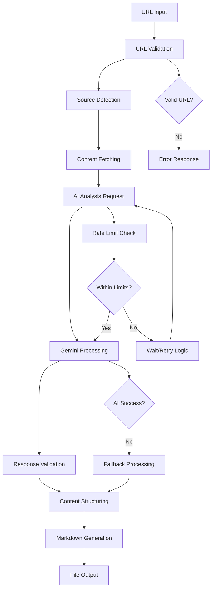
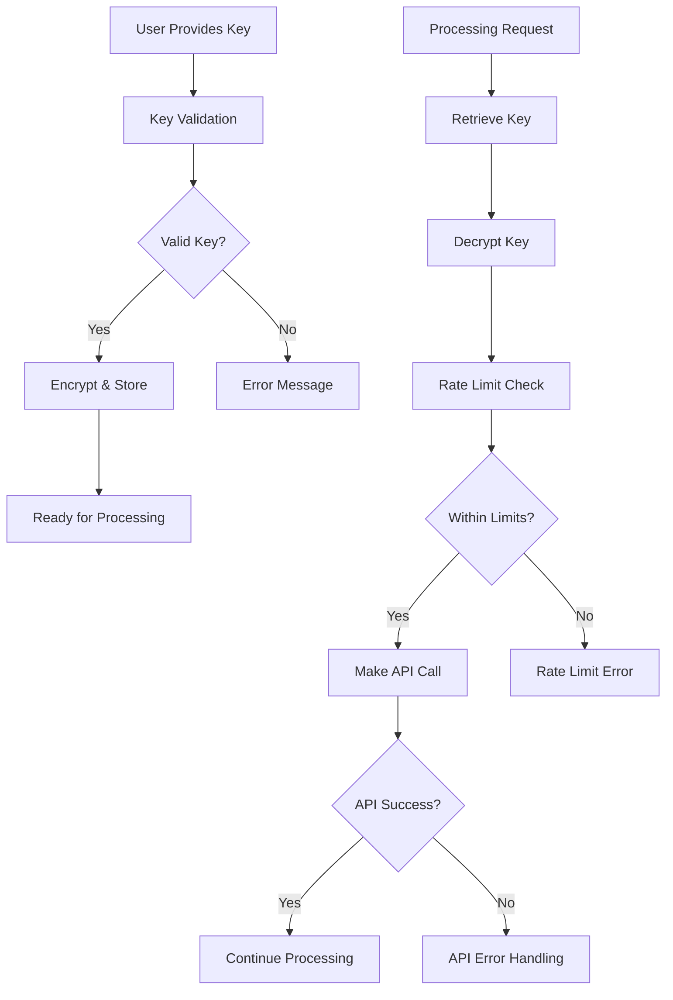

# Obsidianize TUI - Detailed Design Document

**Version**: 1.0  
**Created**: October 11, 2024  
**Project Phase**: Planning Complete → Implementation Ready  

## Table of Contents

1. [System Overview](#system-overview)
2. [Architecture Design](#architecture-design)
3. [Component Specifications](#component-specifications)
4. [API Design](#api-design)
5. [Security Architecture](#security-architecture)
6. [Data Flow Design](#data-flow-design)
7. [User Interface Design](#user-interface-design)
8. [Performance Design](#performance-design)
9. [Error Handling Design](#error-handling-design)
10. [Testing Strategy](#testing-strategy)
11. [Deployment Architecture](#deployment-architecture)
12. [Implementation Guidelines](#implementation-guidelines)

---

## System Overview

### Project Identity
- **Name**: Obsidianize
- **Tagline**: "✨ Your Knowledge, Crystallized ✨"
- **Purpose**: AI-powered content processor transforming web content into structured Markdown notes
- **AI Engine**: Google Gemini API with extended YouTube capabilities
- **Output Format**: "Gemini Gem" format with YAML frontmatter and structured sections

### Dual-Target Architecture
This system implements a **shared-core, dual-interface** architecture:

1. **Web TUI Interface** (Primary MVP): Browser-based terminal simulation
2. **Native CLI Interface** (Secondary): True command-line tool for power users

Both interfaces share identical AI processing capabilities through a common core library.

---

## Architecture Design

### High-Level System Architecture

```
┌─────────────────────────────────────────────────────────────┐
│                    Obsidianize System                       │
├─────────────────────────────────────────────────────────────┤
│  ┌─────────────────┐                 ┌─────────────────┐    │
│  │   Web TUI       │                 │   CLI Tool      │    │
│  │                 │                 │                 │    │
│  │ ┌─────────────┐ │                 │ ┌─────────────┐ │    │
│  │ │ HTML/CSS/JS │ │                 │ │ Terminal UI │ │    │
│  │ └─────────────┘ │                 │ └─────────────┘ │    │
│  │ ┌─────────────┐ │                 │ ┌─────────────┐ │    │
│  │ │ Bun Server  │ │                 │ │ Bun Runtime │ │    │
│  │ └─────────────┘ │                 │ └─────────────┘ │    │
│  └─────────────────┘                 └─────────────────┘    │
│           │                                    │             │
│           └────────────────┬───────────────────┘             │
│                            │                                 │
│  ┌─────────────────────────▼─────────────────────────────┐   │
│  │              Shared Core Library                     │   │
│  │                                                       │   │
│  │  ┌─────────────┐  ┌─────────────┐  ┌─────────────┐   │   │
│  │  │ AI Engine   │  │   Content   │  │    Auth     │   │   │
│  │  │  (Gemini)   │  │ Processing  │  │ Management  │   │   │
│  │  └─────────────┘  └─────────────┘  └─────────────┘   │   │
│  │                                                       │   │
│  │  ┌─────────────┐  ┌─────────────┐  ┌─────────────┐   │   │
│  │  │ Validators  │  │ Generators  │  │   Config    │   │   │
│  │  │ & Detectors │  │   & Utils   │  │ Management  │   │   │
│  │  └─────────────┘  └─────────────┘  └─────────────┘   │   │
│  └─────────────────────────────────────────────────────┘   │
│                            │                                 │
│  ┌─────────────────────────▼─────────────────────────────┐   │
│  │              Google Gemini API                       │   │
│  │         (External AI Processing Service)             │   │
│  └─────────────────────────────────────────────────────┘   │
└─────────────────────────────────────────────────────────────┘
```

### Core Technology Stack

**Runtime & Language:**
- **Runtime**: Bun.js (v1.x) - NOT Node.js
- **Language**: TypeScript with ES2022+ target
- **Module System**: ESM-first, native ES modules
- **Build System**: Bun's native bundling and TypeScript execution

**Key Dependencies (Production):**
```json
{
  "figlet": "^1.7.0",                              // ASCII art (existing)
  "chalk": "^5.6.2",                               // Terminal colors (existing)
  "@google-ai/generativelanguage": "^2.6.0",      // Gemini API client
  "marked": "^9.1.2",                              // Markdown processing
  "yaml": "^2.3.3",                               // YAML frontmatter
  "dompurify": "^3.0.5",                          // HTML sanitization
  "zod": "^3.22.4",                               // Runtime validation
  "bcrypt": "^5.1.1"                              // Encryption utilities
}
```

---

## Component Specifications

### Core Library Structure

```typescript
src/core/
├── ai/                          # Gemini API integration
│   ├── GeminiClient.ts         # Main API client
│   ├── PromptTemplates.ts      # AI prompts for content types
│   ├── ContentAnalyzer.ts      # AI-powered analysis
│   ├── InsightGenerator.ts     # Generate summaries & insights
│   └── ResponseProcessor.ts    # Parse AI responses
├── auth/                       # API key management
│   ├── ApiKeyManager.ts        # Secure key handling
│   ├── RateLimitManager.ts     # Usage monitoring
│   ├── ConfigValidator.ts      # Key validation
│   └── EncryptionService.ts    # Key encryption utilities
├── content/                    # Content processing
│   ├── SourceDetector.ts       # URL pattern detection
│   ├── ContentFetcher.ts       # Unified content fetching
│   ├── MetadataExtractor.ts    # AI-enhanced metadata
│   └── ContentProcessor.ts     # Main processing pipeline
├── output/                     # Output generation
│   ├── MarkdownAssembler.ts    # Final markdown generation
│   ├── FrontmatterBuilder.ts   # YAML frontmatter creation
│   ├── FilenameGenerator.ts    # Standard filename generation
│   └── TagNormalizer.ts        # Tag processing
├── validation/                 # Input/output validation
│   ├── URLValidator.ts         # URL validation
│   ├── ConfigValidator.ts      # Configuration validation
│   └── ResponseValidator.ts    # AI response validation
└── types/                      # Shared type definitions
    ├── GeminiTypes.ts          # AI-related types
    ├── ContentTypes.ts         # Content processing types
    ├── ConfigTypes.ts          # Configuration types
    └── index.ts                # Re-exports
```

### AI Integration Components

#### GeminiClient.ts
```typescript
interface GeminiClientConfig {
  apiKey: string;
  model: 'gemini-pro' | 'gemini-pro-vision';
  temperature: number;
  maxTokens: number;
  rateLimits: RateLimitConfig;
}

class GeminiClient {
  private client: GoogleGenerativeAI;
  private rateLimiter: RateLimitManager;
  
  constructor(config: GeminiClientConfig);
  
  async analyzeContent(
    url: string, 
    content: string, 
    contentType: ContentType
  ): Promise<AnalysisResult>;
  
  async generateInsights(
    analysis: AnalysisResult,
    promptTemplate: string
  ): Promise<InsightResult>;
  
  async validateResponse(response: any): Promise<ValidationResult>;
}
```

#### ContentAnalyzer.ts
```typescript
interface AnalysisRequest {
  url: string;
  content: string;
  contentType: 'youtube' | 'article' | 'paper' | 'podcast';
  analysisMode: 'standard' | 'enhanced' | 'academic';
}

interface AnalysisResult {
  summary: string;
  keyPoints: string[];
  entities: ExtractedEntities;
  topics: string[];
  insights: GeneratedInsight[];
  metadata: AIEnhancedMetadata;
  confidence: number;
  processingTime: number;
}

class ContentAnalyzer {
  async analyzeContent(request: AnalysisRequest): Promise<AnalysisResult>;
  async extractEntities(content: string): Promise<ExtractedEntities>;
  async generateTopics(content: string): Promise<string[]>;
  async assessQuality(analysis: AnalysisResult): Promise<QualityScore>;
}
```

### Authentication & Security Components

#### ApiKeyManager.ts
```typescript
interface ApiKeyConfig {
  key: string;
  encrypted: boolean;
  source: 'user' | 'service' | 'environment';
  permissions: string[];
  expiresAt?: Date;
}

class ApiKeyManager {
  private encryptionService: EncryptionService;
  
  async validateKey(key: string): Promise<ValidationResult>;
  async encryptKey(key: string, passphrase?: string): Promise<string>;
  async decryptKey(encryptedKey: string, passphrase?: string): Promise<string>;
  async storeKey(config: ApiKeyConfig, storage: StorageProvider): Promise<void>;
  async retrieveKey(storage: StorageProvider): Promise<ApiKeyConfig | null>;
  async rotateKey(oldKey: string, newKey: string): Promise<void>;
}
```

#### RateLimitManager.ts
```typescript
interface RateLimitConfig {
  requestsPerMinute: number;
  tokensPerHour: number;
  dailyLimit: number;
  burstAllowance: number;
}

interface UsageTracking {
  requests: number;
  tokens: number;
  resetTime: Date;
  isLimited: boolean;
}

class RateLimitManager {
  private usage: Map<string, UsageTracking>;
  
  async checkLimit(keyId: string): Promise<LimitCheckResult>;
  async recordUsage(keyId: string, tokens: number): Promise<void>;
  async getRemainingQuota(keyId: string): Promise<QuotaInfo>;
  async waitForReset(keyId: string): Promise<void>;
}
```

---

## API Design

### Internal API Specifications

#### Core Processing API
```typescript
// Main processing function
interface ProcessContentRequest {
  url: string;
  options: ProcessingOptions;
  apiKey: string;
  outputPath?: string;
}

interface ProcessingOptions {
  analysisMode: 'standard' | 'enhanced' | 'academic';
  includeTimestamps: boolean;
  includeTranscript: boolean;
  customPrompts?: CustomPromptConfig;
  outputFormat: 'markdown' | 'json' | 'yaml';
  tagOverrides?: string[];
}

interface ProcessingResult {
  success: boolean;
  data?: ProcessedContent;
  error?: ProcessingError;
  metadata: ProcessingMetadata;
}

// Main processing function
async function processContent(
  request: ProcessContentRequest
): Promise<ProcessingResult>;
```

#### Configuration API
```typescript
interface UserConfig {
  apiKey: {
    value: string;
    encrypted: boolean;
    source: 'user' | 'environment';
  };
  preferences: {
    analysisMode: string;
    outputDirectory: string;
    includeTimestamps: boolean;
    customPrompts: Record<string, string>;
  };
  rateLimits: RateLimitConfig;
}

class ConfigManager {
  async loadConfig(configPath?: string): Promise<UserConfig>;
  async saveConfig(config: UserConfig, configPath?: string): Promise<void>;
  async validateConfig(config: Partial<UserConfig>): Promise<ValidationResult>;
  async migrateConfig(oldVersion: number, newVersion: number): Promise<void>;
}
```

### External API Integration

#### Gemini API Integration Pattern
```typescript
interface GeminiRequestConfig {
  model: string;
  prompt: string;
  context?: string;
  temperature: number;
  maxTokens: number;
  safetySettings: SafetySettings;
}

interface GeminiResponse {
  content: string;
  tokensUsed: number;
  confidence: number;
  safetyRatings: SafetyRating[];
  finishReason: string;
}

class GeminiAPIClient {
  async generateContent(config: GeminiRequestConfig): Promise<GeminiResponse>;
  async validateApiKey(key: string): Promise<boolean>;
  async getUsageInfo(key: string): Promise<UsageInfo>;
}
```

---

## Security Architecture

### API Key Security Design

#### Storage Security
```typescript
// Web Interface - Client-side encryption
interface WebKeyStorage {
  encryptionMethod: 'AES-256-GCM';
  storageType: 'sessionStorage' | 'localStorage' | 'memoryOnly';
  keyDerivation: 'PBKDF2' | 'scrypt';
  iterations: number;
}

// CLI Interface - File-based encryption  
interface CLIKeyStorage {
  configPath: string; // ~/.obsidianize/config.json
  filePermissions: '600'; // Read/write for owner only
  encryptionAlgorithm: 'AES-256-GCM';
  keyDerivationFunction: 'scrypt';
}
```

#### Encryption Implementation
```typescript
class EncryptionService {
  private readonly ALGORITHM = 'aes-256-gcm';
  private readonly KEY_LENGTH = 32;
  private readonly IV_LENGTH = 16;
  
  async encryptApiKey(
    plainKey: string, 
    passphrase: string
  ): Promise<EncryptedData>;
  
  async decryptApiKey(
    encryptedData: EncryptedData, 
    passphrase: string
  ): Promise<string>;
  
  generateSalt(length: number = 32): Buffer;
  deriveKey(passphrase: string, salt: Buffer): Promise<Buffer>;
}

interface EncryptedData {
  encrypted: string;
  salt: string;
  iv: string;
  authTag: string;
  algorithm: string;
}
```

#### Security Protocols
1. **No Server-Side Key Storage**: API keys never stored on server
2. **Client-Side Encryption**: All key storage uses strong encryption
3. **Key Validation**: Test keys before storage with minimal API call
4. **Secure Transmission**: HTTPS only, no keys in URLs or logs
5. **Memory Management**: Clear sensitive data from memory after use

---

## Data Flow Design

### Content Processing Pipeline



### API Key Flow



---

## User Interface Design

### Web TUI Interface Specifications

#### Terminal Simulation Design
```css
:root {
  /* Existing color scheme - DO NOT CHANGE */
  --bg-primary: #0f0f23;      /* Dark background */
  --terminal-border: #c084fc;  /* Purple border */
  --ascii-art: #9b59d0;       /* Purple ASCII art */
  --tagline: #d8b4fe;         /* Light purple tagline */
  
  /* Additional UI colors */
  --text-primary: #e2e8f0;    /* Primary text */
  --text-secondary: #94a3b8;   /* Secondary text */
  --success: #10b981;          /* Success messages */
  --error: #ef4444;            /* Error messages */
  --warning: #f59e0b;          /* Warning messages */
  --prompt: #06b6d4;           /* Command prompt */
}
```

#### Component Specifications

**Terminal Window:**
```html
<div class="terminal-window">
  <div class="terminal-header">
    <div class="window-controls">
      <span class="control close"></span>
      <span class="control minimize"></span>
      <span class="control maximize"></span>
    </div>
    <div class="terminal-title">obsidianize@web</div>
  </div>
  <div class="terminal-body">
    <div class="ascii-header">[ASCII Art Header]</div>
    <div class="terminal-content">[Interactive Content]</div>
    <div class="command-prompt">obsidianize@web:~$ <span class="cursor">_</span></div>
  </div>
</div>
```

**Progress Indicators:**
```typescript
interface ProgressState {
  stage: 'fetching' | 'analyzing' | 'processing' | 'generating';
  progress: number; // 0-100
  message: string;
  timeElapsed: number;
  estimatedTimeRemaining?: number;
}

// ASCII Progress Bar
function renderProgressBar(state: ProgressState): string {
  const width = 50;
  const filled = Math.floor((state.progress / 100) * width);
  const bar = '█'.repeat(filled) + '░'.repeat(width - filled);
  return `[${bar}] ${state.progress}% - ${state.message}`;
}
```

### CLI Interface Specifications

#### Command Structure
```bash
# Basic usage
obsidianize <url> [options]

# Interactive mode
obsidianize

# Configuration
obsidianize setup
obsidianize config --show
obsidianize config --set key=value

# Batch processing
obsidianize --batch urls.txt
obsidianize --batch urls.txt --output ./output/

# Advanced options
obsidianize <url> --analysis-mode enhanced --include-timestamps --output custom.md
```

#### CLI Output Design
```typescript
interface CLIRenderer {
  showHeader(): void;
  showProgress(state: ProgressState): void;
  showSuccess(message: string): void;
  showError(error: ProcessingError): void;
  showHelp(): void;
  clearLine(): void;
}

class TerminalRenderer implements CLIRenderer {
  showHeader(): void {
    // Display existing ASCII art header
    console.log(figlet.textSync('OBSIDIANIZE', { font: 'ANSI Shadow' }));
    console.log(chalk.purple('✨ Your Knowledge, Crystallized ✨\n'));
  }
  
  showProgress(state: ProgressState): void {
    process.stdout.write(`\r${this.renderProgressBar(state)}`);
  }
  
  // Additional methods...
}
```

---

## Performance Design

### Bun-Specific Optimizations

#### Startup Performance
```typescript
// Lazy loading for CLI
const loadAIClient = () => import('./core/ai/GeminiClient.js');
const loadContentProcessor = () => import('./core/content/ContentProcessor.js');

// Pre-compiled assets for Web
const server = Bun.serve({
  port: 3000,
  fetch: compiledRequestHandler, // Pre-compiled handler
  static: {
    // Static asset serving optimization
    '/assets': './dist/assets'
  }
});
```

#### Memory Optimization
```typescript
// Streaming processing for large content
async function processLargeContent(url: string): Promise<ProcessingResult> {
  const stream = await fetchContentStream(url);
  const processor = new StreamingProcessor();
  
  // Process in chunks to avoid memory spikes
  for await (const chunk of stream) {
    processor.addChunk(chunk);
  }
  
  return processor.finalize();
}
```

#### Caching Strategy
```typescript
interface CacheConfig {
  aiResponses: {
    ttl: number; // 24 hours
    maxSize: number; // 100MB
    storage: 'sqlite' | 'memory';
  };
  contentFetches: {
    ttl: number; // 1 hour
    maxSize: number; // 50MB
    storage: 'memory';
  };
}

class CacheManager {
  private aiCache: Map<string, CachedAIResponse>;
  private contentCache: Map<string, CachedContent>;
  
  async getAIResponse(key: string): Promise<CachedAIResponse | null>;
  async setAIResponse(key: string, response: AIResponse): Promise<void>;
  async invalidateExpired(): Promise<void>;
}
```

### Performance Targets
- **Web server startup**: <100ms
- **CLI cold start**: <100ms
- **Build time**: <1s for production
- **Memory baseline**: <50MB
- **Hot reload**: <50ms
- **AI processing**: <10s for typical YouTube video

---

## Error Handling Design

### Error Classification System

```typescript
enum ErrorCategory {
  VALIDATION = 'validation',
  NETWORK = 'network',
  AI_API = 'ai_api',
  PROCESSING = 'processing',
  AUTH = 'auth',
  RATE_LIMIT = 'rate_limit',
  SYSTEM = 'system'
}

interface ProcessingError {
  category: ErrorCategory;
  code: string;
  message: string;
  details?: Record<string, any>;
  suggestion?: string;
  recoverable: boolean;
  timestamp: Date;
}
```

### Error Recovery Strategies

```typescript
class ErrorRecoveryManager {
  async handleNetworkError(error: NetworkError): Promise<RecoveryResult> {
    // Retry with exponential backoff
    return this.retryWithBackoff(error.originalRequest, 3, 1000);
  }
  
  async handleRateLimitError(error: RateLimitError): Promise<RecoveryResult> {
    // Wait for rate limit reset
    const waitTime = error.resetTime - Date.now();
    await this.sleep(waitTime);
    return { retry: true, delay: 0 };
  }
  
  async handleAIError(error: AIError): Promise<RecoveryResult> {
    if (error.code === 'CONTENT_TOO_LONG') {
      // Fallback to chunked processing
      return { fallback: 'chunked_processing' };
    }
    return { retry: false, fallback: 'basic_processing' };
  }
}
```

### User-Friendly Error Messages

```typescript
const ERROR_MESSAGES = {
  'INVALID_API_KEY': {
    web: 'Your API key appears to be invalid. Please check your Gemini API key and try again.',
    cli: 'Invalid API key. Run `obsidianize setup` to configure your Gemini API key.'
  },
  'RATE_LIMIT_EXCEEDED': {
    web: 'You\'ve reached your API usage limit. Processing will resume automatically in {timeRemaining}.',
    cli: 'Rate limit exceeded. Waiting {timeRemaining} before retrying...'
  },
  'UNSUPPORTED_URL': {
    web: 'This URL type isn\'t supported yet. Supported types: YouTube, articles, papers.',
    cli: 'Unsupported URL format. Use --help to see supported content types.'
  }
};
```

---

## Testing Strategy

### Test Architecture

```typescript
// Test structure
tests/
├── unit/                       # Isolated component tests
│   ├── ai/
│   │   ├── GeminiClient.test.ts
│   │   └── ContentAnalyzer.test.ts
│   ├── auth/
│   │   ├── ApiKeyManager.test.ts
│   │   └── EncryptionService.test.ts
│   └── content/
│       ├── ContentProcessor.test.ts
│       └── MarkdownAssembler.test.ts
├── integration/               # Component interaction tests
│   ├── ProcessingPipeline.test.ts
│   ├── WebInterface.test.ts
│   └── CLIInterface.test.ts
├── e2e/                      # End-to-end workflow tests
│   ├── WebWorkflow.test.ts
│   ├── CLIWorkflow.test.ts
│   └── RealAPI.test.ts       # With actual Gemini API
├── performance/              # Performance benchmarks
│   ├── StartupTime.bench.ts
│   ├── ProcessingSpeed.bench.ts
│   └── MemoryUsage.bench.ts
└── fixtures/                 # Test data
    ├── sample-responses/
    ├── mock-content/
    └── test-configs/
```

### Testing Configuration

```json
{
  "scripts": {
    "test": "bun test",
    "test:watch": "bun test --watch",
    "test:unit": "bun test tests/unit",
    "test:integration": "bun test tests/integration",
    "test:e2e": "bun test tests/e2e",
    "test:performance": "bun test --bench tests/performance",
    "test:coverage": "bun test --coverage"
  }
}
```

### Mock Strategy for AI Testing

```typescript
// Mock Gemini responses for consistent testing
class MockGeminiClient implements GeminiClient {
  private responses: Map<string, GeminiResponse>;
  
  constructor() {
    this.loadMockResponses();
  }
  
  async analyzeContent(request: AnalysisRequest): Promise<AnalysisResult> {
    const mockKey = this.generateMockKey(request);
    const mockResponse = this.responses.get(mockKey);
    
    if (!mockResponse) {
      throw new Error(`No mock response for: ${mockKey}`);
    }
    
    // Simulate processing time
    await this.simulateDelay(500);
    
    return mockResponse;
  }
  
  private loadMockResponses(): void {
    // Load pre-generated responses from fixtures
  }
}
```

---

## Deployment Architecture

### Web Interface Deployment

```dockerfile
# Bun-optimized container
FROM oven/bun:1-alpine

WORKDIR /app
COPY package.json bun.lockb ./
RUN bun install --frozen-lockfile

COPY . .
RUN bun run build:web

EXPOSE 3000
CMD ["bun", "start"]
```

### CLI Distribution

```typescript
// Build configuration for CLI executable
{
  "scripts": {
    "build:cli": "bun build src/cli/main.ts --compile --outfile obsidianize",
    "build:cli:cross": "bun build:cli --target linux-x64 --target macos-arm64 --target windows-x64",
    "package": "tar -czf obsidianize-${VERSION}-${PLATFORM}.tar.gz obsidianize README.md LICENSE"
  }
}
```

### Environment Configuration

```typescript
// Development
interface DevConfig {
  NODE_ENV: 'development';
  GEMINI_API_KEY: string;
  DEBUG: 'obsidianize:*';
  PORT: 3000;
}

// Production  
interface ProdConfig {
  NODE_ENV: 'production';
  PORT: number;
  CORS_ORIGINS: string[];
  RATE_LIMIT_WINDOW: number;
  LOG_LEVEL: 'error' | 'warn' | 'info';
}
```

---

## Implementation Guidelines

### Development Workflow

1. **Environment Setup**
   ```bash
   git clone [repo-url]
   cd obsidianize-tui
   bun install
   cp .env.example .env
   # Add your Gemini API key to .env
   bun dev
   ```

2. **Development Standards**
   - Use TypeScript strict mode
   - Follow ESM module patterns
   - Write tests for all public APIs
   - Document complex algorithms
   - Use Bun-native features where possible

3. **Code Organization**
   - One component per file
   - Export interfaces alongside implementations  
   - Use barrel exports (`index.ts`) for clean imports
   - Keep side effects minimal and explicit

### Integration Points

#### Web-CLI Shared Code
```typescript
// src/core/index.ts - Main shared API
export { processContent } from './content/ContentProcessor.js';
export { GeminiClient } from './ai/GeminiClient.js';
export { ApiKeyManager } from './auth/ApiKeyManager.js';
export type { ProcessingOptions, ProcessingResult } from './types/index.js';
```

#### Interface-Specific Code
```typescript
// src/web/main.ts
import { processContent } from '../core/index.js';
const result = await processContent(request);
// Handle web-specific UI updates

// src/cli/main.ts  
import { processContent } from '../core/index.js';
const result = await processContent(request);
// Handle CLI-specific output
```

### Security Implementation Checklist

- [ ] API keys never logged or exposed in client-side code
- [ ] All key storage uses strong encryption (AES-256-GCM)
- [ ] Config files have restricted permissions (600)
- [ ] HTTPS enforced for all web traffic
- [ ] Rate limiting implemented at multiple levels
- [ ] Input validation on all user-provided data
- [ ] Error messages don't leak sensitive information
- [ ] Memory cleared after processing sensitive data

---

## Success Criteria

### Technical Requirements
- **Performance**: Sub-100ms startup, <10s AI processing
- **Reliability**: <1% failure rate for valid inputs
- **Security**: Zero API key exposure incidents
- **Quality**: AI output >85% accuracy vs human evaluation
- **Compatibility**: Works across macOS, Linux, Windows

### User Experience Requirements
- **Usability**: Non-technical users successful within 60 seconds
- **Visual Appeal**: Screenshot-worthy terminal aesthetic
- **Accessibility**: WCAG 2.1 AA compliance for web interface
- **Documentation**: Complete setup and usage guides
- **Error Handling**: Clear, actionable error messages

---

## Next Steps

This design document provides the foundation for implementation. The next phase involves:

1. **Sprint Planning**: Break down components into development tasks
2. **Environment Setup**: Configure development environment with Gemini API
3. **Core Implementation**: Start with shared AI processing engine
4. **Web MVP Development**: Build functional web interface
5. **CLI Extension**: Extend to command-line interface

**Estimated Timeline**: 9 weeks total
- Weeks 1-5: Web MVP with AI integration
- Week 6: Architecture extraction and cleanup  
- Weeks 7-9: CLI implementation and polish

---

*This document serves as the single source of truth for implementation decisions and should be updated as the system evolves.*

<citations>
<document>
<document_type>RULE</document_type>
<document_id>/Users/ambrealismwork/Desktop/Coding-Projects/Obsidianize-TUI_SIM/agents.md</document_id>
</document>
</citations>